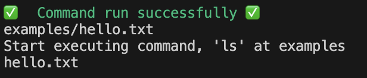
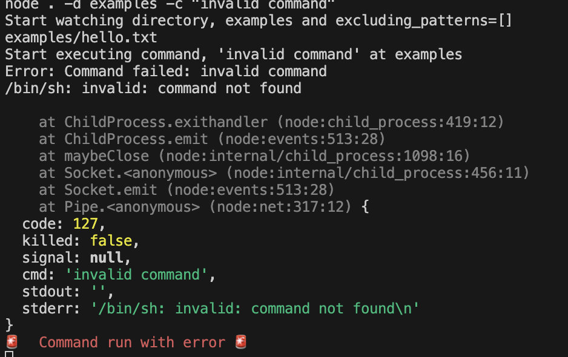

# watching-cmd

Watch directory and run command if there is changes.

## Project Setup & Commands

### Install required library

```shell
npm install
```

### Build the files

```shell
npm run build
```

### Run the program

```shell
npm start -d <<directory>>
```

For example

```shell
node . -d examples -c "ls"
```

## Features

### Success execution of command

If the command run successfully, it will output a "success" sound with green message.



### Error execution of command

If the command did not run successfully, it will output a "error" sound with red message.



## Hommage

This idea cames from watching [James Shore](https://github.com/jamesshore/livestream)'s lunch and learn Youtube series.
